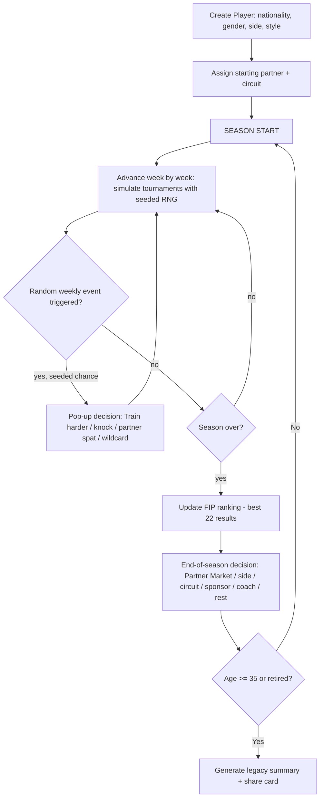

# Padel Career Simulator — Build Plan

> A browser-based, decision-driven padel career simulator inspired by Copero
> (`copero.com.ar/juegos/simulador-carrera`), adapted for professional padel.
> Deployable on Vercel. This document is the spec you hand to Claude Code.

**Status:** FINAL — all design forks resolved (see §17). Ready to hand to Claude Code.

---

## 1. Vision & Core Fantasy

You are a padel player. You start at **16** with raw potential and grind from local
FIP Bronze tournaments up to the Premier Padel elite. You never play points directly —
instead you make **career decisions** (partners, side, circuit, training, injuries,
sponsors) and a **seeded simulation** resolves each tournament and season. A career runs
**16 → 35** and ends with a **shareable summary card** (titles, ranking peak, partners,
earnings, legacy tier).

The emotional hook, adapted from Copero, is: *fast, unpredictable, replayable, shareable.*
A full career should take **2–5 minutes**.

What makes the **padel** version distinct from a football sim:

1. **It's a doubles sport.** Your career is defined by your **partner** (compañero/a). Partner
   chemistry, breakups, and "trading up" are the central drama. Real top-200 players are your
   potential partners and rivals.
2. **Sides matter.** You play **Drive** (right) or **Revés** (left). Each rewards a different
   attribute mix. Switching your natural side costs OVR (a requested mechanic).
3. **Circuits, not clubs.** Progression is choosing which circuit tier to compete on:
   `FIP Bronze+Silver` → `FIP Gold+Platinum` → `Premier`. Switching is a core strategic lever.

**Interface (from the reference screenshot):** the whole game lives on a **single dense, dark
screen** — left column is the player identity card + the active decision (2–4 option cards with
colored consequence tags), right column is an **age-by-age career ledger table** that fills in live
as you progress. In football that ledger's per-row anchor is the *club*; here it's the **partner**.
The finished ledger doubles as the shareable result. Full layout spec in §14.

---

## 2. What We Borrow from Copero (and What Changes)

| Copero (football) | This game (padel) |
|---|---|
| Create player: name, nationality, position, foot, number | Create player: name, nationality, **gender/tour**, **side (Drive/Revés)**, handedness |
| Position (GK/DEF/MID/FWD) | **Side** (Drive/Revés) + **playstyle** archetype |
| Clubs & leagues, transfers, loans | **Circuits** (FIP Bronze→Premier) + **partners** |
| OVR 16→99, seeded sim | OVR 16→99, seeded sim (kept) |
| Decisions every 1–3 seasons (mode) | Random weekly pop-ups in-season **+** one end-of-season card |
| Injuries, doping, training, nationalization | Injuries, training, partner politics, sponsor deals, side-switch, circuit-switch |
| Ballon d'Or / Golden Boot | FIP #1, Major titles, Best Smash, breakout of the year |
| Final share card | Final share card (kept — critical for virality) |
| No account, runs in browser | Same. Optional local persistence only. |

---

## 3. Core Game Loop



**Two kinds of decision, different cadence:**

- **In-season pop-ups (random, week-to-week).** As the season plays out week by week, short-horizon
  decision cards **fire at random** (seeded) between tournaments — e.g. *"Train harder,"* a niggling
  injury, a partner argument, a wildcard offer, a technique tweak. These are frequent, low-stakes,
  and interrupt the flow exactly like the reference. Not a single fixed checkpoint — they surface
  probabilistically, so no two seasons trigger the same set.
- **End-of-season decision (scheduled, high-stakes).** Once per season the big card appears: the
  **Partner Market** (§5) plus side/circuit/sponsor/coach/rest choices.

**Random-event model:** each in-season week rolls a seeded chance of an event; event type is drawn
from a weighted pool gated by context (fatigue high → injury/rest event more likely; a hot streak →
wildcard offer more likely; partner chemistry low → tension event more likely). Frequency is tuned
so a season yields roughly **1–3 pop-ups** on average — enough to feel alive, not spammy.

**✔ RESOLVED — two pace modes.** The end-of-season **Partner Market card always fires** (the big
decision). The in-season random pop-up frequency is what the mode tunes:
- **Story mode** ≈ **2 decisions/season** — the end-of-season card **+ ~1 in-season pop-up** on
  average. Immersive default.
- **Quick mode** ≈ **1 decision/season** — mostly just the end-of-season card; in-season pop-ups are
  rare. For fast replays.
Both use the same seeded, context-weighted trigger model (§3); the mode only scales pop-up
probability.

---

## 4. Player Model & OVR

OVR is a 16–99 rating derived from weighted attributes. Attributes are padel-authentic:

| Attribute | Description | Weighted toward |
|---|---|---|
| `remate` (Smash) | Power finishing overhead | Drive |
| `volea` (Volley) | Net control, both volleys | Both |
| `bandeja` | The signature defensive overhead / tempo control | Revés |
| `vibora` | Aggressive slice overhead | Drive |
| `defensa` | Lobs, retrieving, patience | Revés |
| `pared` (Walls) | Playing balls off the back/side glass | Both |
| `velocidad` (Speed) | Court coverage & reaction | Both |
| `mental` | Consistency, clutch, pressure | Both |

**Side weighting.** Drive players lean on `remate`/`vibora`/`volea` (finishers). Revés players
lean on `bandeja`/`defensa`/`mental` (playmakers who set up the point). The OVR formula
applies a side-specific weight vector so the same raw attributes yield a different OVR depending
on the side you play.

```
OVR(side) = round( Σ (attribute_i × weight[side][i]) )   // clamped 16..99
```

**Playstyle archetypes** (chosen at creation, bias starting attributes & growth):
- **Pegador / Power** — high remate/víbora, lower defensa. Classic Drive.
- **Táctico / Playmaker** — high bandeja/mental, patient. Classic Revés.
- **Contragolpe / Counterpuncher** — high defensa/velocidad, wins on retrieval.
- **Completo / All-court** — balanced, slower to peak but higher ceiling.

**Growth curve.** Potential is a hidden cap (like Copero). OVR rises fast 16→24, peaks ~25–30,
declines after ~31 unless "veteran mental" offsets physical decline. Decisions (training,
coach, injuries) nudge growth up or down.

**✔ RESOLVED — show numbers.** OVR and attributes are shown as numbers (color-coded pills, as in the
reference). No purist/hidden-number mode in scope.

---

## 5. The Partner System (the heart of the game)

Padel is doubles, so your **partner** is as important as your own OVR. This system is the main
source of drama and the main consumer of the top-200 dataset.

**Team strength model:**
```
TeamStrength = f(yourOVR, partnerOVR, chemistry, sideBalance)

sideBalance:  bonus if you and partner cover complementary sides (one Drive, one Revés);
              penalty if you both prefer the same side (someone plays off-side).
chemistry:    0..100, grows each season you stay together, resets on breakup,
              modified by results (winning builds it, early losses erode it).
```

**Partner lifecycle:**
- You **start** paired with an appropriately-ranked player (near your level/circuit).
- **Better partners become available** as you climb — a top-20 player might offer to pair with
  you after a breakout season. Accepting may require **switching sides** (they already own theirs).
- Partners can **leave you** for a better-ranked player if you underperform (the "Lebrón/Galán
  breakup" flavor). This is a mid- or end-of-season event.
- **Chemistry vs raw level tradeoff:** a long-tenured partner with high chemistry can outperform
  a higher-rated new pairing for a season or two.

**The Partner Market ("mercado de parejas") — the marquee end-of-season decision.** This is padel's
real transfer window and it maps *exactly* onto the reference's "Transfer window" card (3 options,
each tagged with a tier label). At season's end you're shown **2–3 partner offers + a "Stay with
[current partner]" card**:
- Each **offer card** shows the prospective partner (flag/name) and a **circuit-band tier label**
  underneath — the direct analogue of the reference's `LaLiga / Championship / Ligue 1` labels.
  Here the label is `Premier P1` / `FIP Gold` / `FIP Bronze`, telling you what level that partner
  competes at.
- **This is where partner-switch and circuit-switch converge:** accepting a Premier-tier partner
  *is* your move up to the Elite band; a "Stay" keeps your partner **and** your current band and
  preserves chemistry. Accepting may also demand a **side switch** (shown as a `🔻 OVR` tag on the
  card) if that partner owns your side.
- Offers that appear depend on your **season results, ranking, and OVR** — a breakout season
  surfaces better partners; a poor one surfaces lateral or downward moves (or a breakup where your
  current partner leaves and you must pick from what's left).

**✔ RESOLVED — real named partners.** Partners, rivals, and tournament fields all use **real named
players** from the top-200 pool. Ship with an "unofficial fan-made simulator" disclaimer since it's
clearly a hypothetical simulation.

**✔ RESOLVED — single-tour careers (not mixed).** A career stays entirely within **one tour**
(Men's *or* Women's, chosen at creation). No mixed events; men's and women's pools/rankings are
fully separate.

---

## 6. Sides: Drive vs Revés

- At creation you pick your **natural side**. It sets your attribute bias and OVR weighting.
- **Switching sides reduces overall level** (explicit requirement). Model it as: on switch,
  apply an immediate OVR penalty (e.g. **−6 to −10**) that **decays over ~2–3 seasons** as you
  re-adapt, but never fully recovers to your natural-side ceiling (a small permanent −1/−2).
- Reasons a player switches: a coveted partner needs you on the other side; your natural side is
  crowded with rivals; strategic fit. This makes side-switching a real dilemma, not a free action.

```
onSwitchSide():
    penalty = base_penalty(playstyle)      // e.g. 8
    apply immediate OVR -penalty
    schedule decay: -penalty → -2 over 3 seasons
    naturalSide unchanged (for ceiling calc)
```

---

## 7. Circuits & Progression

Three selectable **circuit bands**, each with real tournament categories:

| Band | Categories | Winner pts (approx) | Prize band | Field strength | Who plays here |
|---|---|---|---|---|---|
| **Developmental** | FIP Bronze / Silver | 40 / 80 | €7k–30k | Low | 16–20, rebuilders, promises |
| **Professional** | FIP Gold / Platinum | 150 / 300 | €50k–150k | Medium | Top-100 grinders |
| **Elite** | Premier P2 / P1 / Major | 500 / 1000 / 2000 | High | Highest | Top-50, stars |
| *(auto)* | Barcelona Finals | Season-end masters | — | Top 16 | Qualification only |

**The strategic tension (the requested "switch circuit" lever):**
- Stay in **Developmental** and you're a big fish: easy wins, points, and confidence — but low
  money, low prestige, and a soft ceiling. Good for teens building ranking.
- Jump to **Elite** too early and you lose in early rounds, earn little, and stall your ranking —
  but if you're ready, the points/money/fame compound fast.
- **Professional** is the sensible middle and the usual bridge.

**Access rules:** higher bands require a minimum FIP ranking / OVR to enter main draws (with a
limited number of **wildcards** available as mid-season events). This makes circuit choice a
gated, meaningful decision rather than a free toggle.

**Ranking engine:** mirrors real FIP — your **best 22 results** across the season's played
tournaments form your ranking points. Separate men's/women's ladders.

---

## 8. Calendar & Season Structure

Use the **real 2026 calendars** as the base template (regenerated/rotated each in-game season):

- **Premier Padel 2026:** ~25 events — 4 Majors (Qatar, Italy, France, Mexico), P1s (Riyadh,
  Miami, London, Buenos Aires, Madrid, Valencia…), P2s, + Barcelona Finals (top 16).
  Source: `en.wikipedia.org/wiki/Premier_Padel_2026`.
- **CUPRA FIP Tour 2026:** 200+ events across Bronze/Silver/Gold/Platinum worldwide, ending with
  FIP Finals in early December. Source: `en.wikipedia.org/wiki/2026_FIP_calendar` + `padelfip.com`.

**Implementation:** don't hardcode all 200+ FIP events into the loop. Instead:
- Store the **real calendar** as reference data (dates, cities, categories) in JSON.
- The engine picks a **representative slice** of tournaments per season for the player's chosen
  band (e.g. ~15–20 events/season they realistically enter), drawing names/cities/categories from
  the real calendar for authenticity.
- Later in-game years **rotate** the calendar (same category mix, refreshed as the meta shifts) so
  a 19-season career doesn't replay identical fixtures.

**✔ RESOLVED — rotated after 2026.** In-game **year 1 uses the real 2026 calendar** (dates, cities,
categories) verbatim. **Subsequent in-game years are procedurally rotated** from it — same category
mix and rhythm, refreshed venues/timing — so a full 16→35 career never replays identical fixtures.

---

## 9. Simulation Engine

**Seeded & deterministic-but-varied**, exactly like Copero ("two similar careers finish
differently"). A single career seed drives all RNG so a run is reproducible/shareable.

**Tournament resolution (no live points):**
```
for each tournament the player enters:
    field = sample opponents from player pool appropriate to category
    for each round:
        pWin = logistic( (TeamStrength - OpponentTeamStrength) / scale )
        pWin += clutch(mental), form, fatigue, injury modifiers
        result = seededBernoulli(pWin)
        if lose: break (record round reached)
    award ranking points + prize money by round reached
    update form, fatigue, chemistry, earnings, stats
```

**Season resolution:** aggregate tournament results → update FIP ranking (best 22) → compute
season awards (titles, finals, ranking peak) → surface end-of-season decision.

**Modifiers to track per player:** `form` (hot/cold streak), `fatigue` (too many events →
injury risk & performance dip), `injury` (duration, OVR dampening while recovering),
`morale`/`chemistry`.

**RNG:** use a small seeded PRNG (e.g. `mulberry32`/`sfc32`) so the whole career derives from
one seed string. Store the seed in the share card so results are reproducible.

---

## 10. Events & Decisions

Decisions are the gameplay. Each is a card with 2–4 options, probabilistic outcomes, and clear
tradeoffs (never guaranteed — Copero-style "orientative probability").

**Card format (reference-matched):** bold event title + one-line description, then 2–4 option
cards side by side. Each option shows optional imagery and **one or more stacked consequence tags** —
an option can carry **both** a green upside **and** a red downside at once (the reference's "Finish
high school → Accept" shows green `+1 OVR for maturity` *and* red `Temporary lesser role` together),
or a neutral grey tag like `No changes`. Red = downside (`🔻 OVR −8`, `chemistry resets`,
`miss 2 events`), green = upside (`+80 pts`, `+morale`, `+sponsor €`), grey = neutral. Outcomes stay
probabilistic: tags signal *direction/likely effect*, not a guarantee.

### In-season pop-ups (random, week-to-week — short horizon)
These fire **at random during the season** (seeded, context-weighted per §3), not at a fixed point —
matching the reference's "Train harder"-style cards that interrupt the weeks:
- **Train harder / extra block:** chance at +OVR/attribute vs fatigue & minor injury risk.
- **Injury knock:** rest (miss events, lose points) vs play through (injury-worsen risk).
- **Partner tension:** smooth it over vs let it simmer (affects chemistry / breakup odds).
- **Wildcard offer:** accept entry into a bigger event (upside points, downside early exit + travel fatigue).
- **Technique tweak** with a coach: attempt to raise a weak attribute (probabilistic, may not stick).
- **Prioritize:** target a specific tournament vs spread load / rest.
- **Off-court / life moment:** studies (e.g. "finish high school"), media, sponsor, or morale beats
  for flavor — can carry mixed tags (a maturity +OVR alongside a temporary lesser role).

### End-of-season events (long horizon)
- **Partner Market ("mercado de parejas") — the primary end-of-season card** (see §5): 2–3 partner
  offers each tagged with a circuit-band tier label, plus a "Stay with current partner" option.
  Trading up may require a side switch; accepting a higher-band partner *is* the circuit move-up.
  Modeled on the reference's 3-option "Transfer window" card.
- **Switch side:** Drive↔Revés (OVR penalty per §6) — usually bundled into accepting a partner offer.
- **Switch circuit band directly:** if you want to change bands *without* changing partner
  (move up/down, gated by ranking) — the standalone version of the central strategic call.
- **Sign a sponsor:** income + morale; some carry expectations/pressure.
- **Hire a coach / physio:** growth or injury-resistance boost, at a cost.
- **Rest year / manage load** as you age to delay decline.
- **Nationalization / represent country** at World Championship (flavor + morale).

**✔ RESOLVED — include a doping/supplement risk event.** As a rare, high-stakes decision node
(mirroring Copero). Kept **abstract and consequence-focused** — no real substances, methods, or
how-to. Mechanically: accept a shady performance edge for a chance at a temporary OVR/results
boost, against a **risk of a ban** that costs ranking, earnings, and reputation (and can end a
career). Decline for no change. It's a gamble about consequences, not a guide to anything real.

**Event catalog is i18n-keyed.** Each event is data, not prose in code: `{ id, trigger, weight,
options: [{ effectDeltas, tagKeys }] }`. Its **title, description, and consequence-tag text are
translation keys** (e.g. `event.finish_school.title`) resolved per locale in `/messages/*.json`.
This is what lets the whole decision system exist in EN + PT (and later ES) with zero engine changes.

---

## 11. Player Pool: Top 200 + Promises

**Purpose:** partners, rivals, and tournament fields all draw from this pool for authenticity and
variety — and the "promises" ensure fresh names appear when your player is in their 30s.

**Composition (per tour, men's & women's):**
- **Top ~200 FIP** ranked players (real names, nationality, natural side, an estimated OVR &
  attribute profile derived from their ranking/results).
- **Top ~50 FIP "NextGen"/promises** per category — younger players (16–20) who **enter the active
  pool over in-game years**, so by the time you're 30–35 there's a wave of new stars.

**Regen system:** when a real player reaches ~35–38 they **retire** and are replaced by a promise
(or a procedurally generated newcomer with a plausible nationality/side/name). This keeps the pool
alive across a full 19-season career without the world feeling frozen.

**Data sourcing strategy (do this during build):**
1. Scrape/compile current FIP rankings from `padelfip.com` (men's & women's) — name, country,
   points, ranking. Rank → estimated OVR via a mapping curve (#1 ≈ 95+, #200 ≈ 60s).
2. Infer **natural side** and **playstyle** from public info where available; otherwise assign
   heuristically and allow manual correction in the JSON.
3. Compile NextGen/U18–U21 promise lists from FIP junior results / NextGen features.
4. Store everything as **static JSON** (`/data/players.men.json`, `/data/players.women.json`,
   `/data/promises.*.json`). No live API needed at runtime.

**✔ RESOLVED — rank-derived attributes for all.** Every real player's attributes/OVR are derived
from FIP ranking via the mapping curve (#1 ≈ 95+, #200 ≈ 60s), with side/playstyle assigned
heuristically. No manual hand-tuning required — the JSON stays editable if you want to tweak later.

**✔ RESOLVED — ship real player names.** With a clear **"unofficial fan-made simulator, not
affiliated with FIP/Premier Padel"** disclaimer in the footer/about.

---

## 12. Data Model (schemas)

```ts
type Side = "drive" | "reves";
type Tour = "men" | "women";
type Band = "developmental" | "professional" | "elite";
type Category = "bronze" | "silver" | "gold" | "platinum" | "p2" | "p1" | "major" | "finals";

interface Attributes {
  remate: number; volea: number; bandeja: number; vibora: number;
  defensa: number; pared: number; velocidad: number; mental: number;
}

interface Player {
  id: string;
  name: string;
  country: string;          // ISO code for flags
  tour: Tour;
  naturalSide: Side;
  currentSide: Side;
  playstyle: "power" | "playmaker" | "counter" | "allcourt";
  attributes: Attributes;
  potential: number;        // hidden OVR cap
  age: number;
  ovr: number;              // derived
  isReal: boolean;          // real vs regen/promise
  debutYear?: number;       // for promises entering later
}

interface CareerState {
  seed: string;
  you: Player;
  partnerId: string | null;
  chemistry: number;        // 0..100
  band: Band;
  season: number;           // 1..N
  year: number;             // in-game calendar year
  rankingPoints: number;
  results: TournamentResult[];   // best 22 feed ranking
  form: number; fatigue: number; injury: Injury | null; morale: number;
  earnings: number;
  sponsors: Sponsor[];
  history: SeasonSummary[];      // per-season rows for the ledger
  partnerships: PartnershipRecord[]; // aggregates for the final "defining partnerships" card
  awards: Award[];               // FIP #1 seasons, Best Smash, Breakout, etc.
  worlds: { country: string; apps: number; golds: number };
}

// Computed by grouping results by partnerId across the whole career.
interface PartnershipRecord {
  partnerId: string; seasonsTogether: number;
  titles: number; finals: number; matchesWon: number;
  firstYear: number; lastYear: number;
}

interface Award { type: "fip_no1" | "major" | "best_smash" | "breakout" | string; year: number; }

interface Tournament {
  id: string; name: string; city: string; country: string;
  category: Category; band: Band; week: number; points: PointsTable;
}

interface TournamentResult {
  tournamentId: string; roundReached: number;
  points: number; prize: number; partnerId: string; year: number;
}
```

The final "CAREER COMPLETE" card (§14) is built from `partnerships` (sorted by seasons/titles →
the 1–2 defining panels), `awards` (the trophy case, with an honest empty state), and `worlds`.

Static reference data files:
```
/data/players.men.json        // ~200 real players
/data/players.women.json
/data/promises.men.json        // ~50 NextGen, staggered debut years
/data/promises.women.json
/data/calendar.premier.json    // Premier 2026 template
/data/calendar.fip.json        // FIP Bronze→Platinum 2026 template
/data/points.json              // points-by-round-by-category tables
```

---

## 13. Tech Stack & Architecture (Vercel-ready)

- **Framework:** **Next.js (App Router) + TypeScript** — first-class on Vercel, zero-config deploy.
- **Rendering:** primarily **client-side** career sim (like Copero, no accounts). Static export of
  data. No server DB required for MVP.
- **State:** in-memory career state (React context / Zustand). **Optional** `localStorage` for
  "resume career" and to remember settings — *note: if any part is built as a sandboxed artifact
  first, localStorage is unavailable there; use in-memory only in that environment.*
- **Styling:** Tailwind CSS. Component set your call (shadcn/ui recommended for speed).
- **i18n (first-class):** **`next-intl`** (App Router-native, Vercel-friendly) with **locale-routed
  `/[locale]` segments**. Translations live in `/messages/{locale}.json`. Launch locales **`en` + `pt`**;
  add `es`/others by dropping in a file and listing the locale. A `<LanguageSwitcher>` sets and
  persists the locale. Middleware handles locale detection/redirect. **No user-facing string is
  hardcoded** — components read from the message catalog.
- **Simulation:** pure TypeScript modules in `/lib/sim` — framework-agnostic and unit-testable.
  The sim is **language-agnostic**: it emits **event/award keys**, not prose; the UI layer resolves
  keys → localized text. (Keeps the engine clean and every language consistent.)
- **Seeded RNG:** tiny PRNG util (`mulberry32`), seeded from a career seed string.
- **Share card:** render to canvas / use `@vercel/og` (Satori) to generate an OG image for sharing —
  **localized** to the player's chosen language.
- **Analytics/ads (optional):** Copero monetizes via AdSense; leave hooks but keep MVP clean.

**No backend needed for MVP.** If you later want global leaderboards or saved careers across
devices, add a lightweight store (Vercel KV / Postgres) — but that's post-MVP.

### Suggested folder structure
```
/app
  /[locale]                 // locale-routed: /en, /pt (later /es, ...)
    /page.tsx               // landing / start career
    /play/page.tsx          // main career loop UI
    /result/page.tsx        // final share card
  /middleware.ts            // next-intl locale detection & routing
/messages
  en.json                   // English UI strings + event/award text (launch)
  pt.json                   // Portuguese (launch)
  es.json                   // Spanish (drop-in later — same keys)
/components
  PlayerCreator.tsx  DecisionCard.tsx  SeasonBoard.tsx
  RankingTable.tsx   ShareCard.tsx     PartnerPanel.tsx  LanguageSwitcher.tsx
/lib
  /i18n         // next-intl config, locale list, helpers
  /sim
    ovr.ts        // attribute→OVR weighting per side
    match.ts      // tournament & round resolution
    season.ts     // season aggregation, ranking (best 22)
    events.ts     // decision logic — emits event KEYS + effects, no prose
    partners.ts   // pairing, chemistry, breakup logic
    growth.ts     // aging, potential, decline
    regen.ts      // retirements + promise/newcomer intake
    rng.ts        // seeded PRNG
  /data           // loaders + types
/data             // static JSON described in §12
/public           // flags, images, share-card assets
```

---

## 14. UI / UX Screens

> **Reference-matched.** The Copero screenshot shows the whole game on a **single dense, dark
> screen, two columns**: a left identity+decision panel and a right **age-by-age career ledger
> table**. We replicate this layout. The football ledger's per-row anchor is the *club*; padel has
> no clubs, so **our per-row anchor is the PARTNER** (the thing that changes yearly and carries the
> drama). Everything below maps 1:1 to what's on screen in the reference.

### Main screen layout (the career board)

```
┌─────────────────────────────┬──────────────────────────────────────────────┐
│  LEFT: Identity + Decision   │  RIGHT: Career ledger (one row per age)       │
│                              │                                                │
│  ┌────┐  🇦🇷 ◀REVÉS          │  AGE  PARTNER          SIDE OVR TTL RANK  €    │
│  │OVR │  Name                │  16   Nadia Sánchez    RV   48   0  #180  4k   │
│  │ 78 │  ▸ w/ [Partner]      │  17   Nadia Sánchez    RV   54   1  #120  9k   │
│  └────┘  AGE 24  €1.2M       │  18 ↳ Nadia Sánchez    RV   58   2   #88  22k  │
│                              │  19   Marta Ortega     RV   64   3   #61  55k  │
│  TITLES  FINALS  WEEKS#1     │  20   Marta Ortega     DR   61*  1   #70  40k  │
│    12      21       0        │  ...                                            │
│         🏆                   │  24   [current] ...    ...  78  ...  ...  ...   │
│                              │  25   ? Career decision...      78             │
│  ── DECISION ──              │  26                                             │
│  "Partner ultimatum"          │  ...  (future ages greyed out to 35)          │
│  Coello will pair with you   │  ─────────────────────────────────────────    │
│  — but only on the Drive.    │  🌍  Argentina (World Championship)  ▸ 3 titles│
│  ┌─────────┐  ┌─────────┐    │                                                │
│  │ Accept  │  │ Stay w/ │    │                                                │
│  │ (switch │  │ Marta   │    │                                                │
│  │  side)  │  │         │    │                                                │
│  │ 🔻OVR-8 │  │ keep    │    │                                                │
│  │         │  │ chem    │    │                                                │
│  └─────────┘  └─────────┘    │                                                │
└─────────────────────────────┴──────────────────────────────────────────────┘
```

**Left panel — identity card** (maps to Copero's OVR/flag/#17 ST/club/value block):
- **OVR badge** (big, color-coded) — same as reference.
- **Flag + SIDE tag** (`DRIVE`/`REVÉS`) — replaces Copero's shirt number + position (`#17 ST`).
- **Name** + **`w/ [current partner]`** line — replaces the current-club line.
- **AGE** + **career EARNINGS** (`€1.2M`) — replaces `VALUE €9.9M`.
- **Career totals row:** `TITLES · FINALS · WEEKS AT #1` — replaces `APPS · GOALS · AST`.
- Trophy motif kept.

**Left panel — decision** (maps exactly to Copero's "Controversial statement" / "Transfer window" blocks):
- Bold **event title** + one-line description.
- **2–4 option cards** side by side (a 3rd option centers/wraps to a second row, as in the reference's
  Transfer-window screenshot). Each optionally shows imagery and **one or more stacked consequence
  tags** — an option may carry a green upside and a red downside simultaneously, or a neutral grey
  `No changes`. This mirrors the reference's "Finish high school" (green + red stacked) and "Your
  minutes decrease" (single red) cards.
- **Partner-market cards additionally show a tier label** under each option (`Premier P1` /
  `FIP Gold` / `FIP Bronze`) — the direct analogue of the reference's `LaLiga / Championship /
  Ligue 1` labels — so the player reads the level/risk of each partner at a glance.

**Right panel — career ledger** (the spine; maps to Copero's AGE/CLUB/OVR/APPS/GOALS/AST table):

| Reference (football) | This game (padel) |
|---|---|
| `AGE` badge (color-coded) | `AGE` badge (kept) |
| `CLUB` (crest + name) | **`PARTNER`** (flag + name) — the yearly anchor |
| — | **`SIDE`** (`DR`/`RV`) — shows side-switch years, mark with `*` when penalized |
| `OVR` pill (color-coded) | `OVR` pill (kept) |
| `APPS` | **`TTL`** (titles that season) |
| `GOALS` | **`RANK`** (year-end FIP rank) |
| `AST` | **`€`** (season earnings) |
| loan arrow `↳` | **continuation arrow `↳`** = same partner as prior year (chemistry building) |
| future ages greyed 31–39 | future ages greyed to **35** |
| bottom `Portugal` national row | bottom **World Championship / country** row (titles/appearances) |

The ledger **fills in live** as seasons simulate; the current age shows `? Career decision...` when
an intervention is pending (exactly like the reference's row 30).

### Other screens
- **Landing / Start:** title, "Start Career", **pace toggle (Story / Quick)**, language selector.
- **Player Creator ("Define your identity") — reference-matched 3-column layout:**
  - **Column 1 — Identity:** a **kit/paddle preview** showing last name + number in national colors;
    `LAST NAME` field; optional `NUMBER` field; a **`TOUR` toggle (Men's / Women's)** since the
    player pools/rankings are separate; and a **`PREFERRED HAND` toggle (Left / Right)** —
    the padel equivalent of the reference's `PREFERRED FOOT`. Handedness is *meaningful* here:
    left-handers are prized and often suit a specific side, so it feeds the OVR/side fit.
  - **Column 2 — Nationality:** searchable country list with flags (two-column, scrollable) —
    identical to the reference.
  - **Column 3 — Side (replaces the football pitch):** a **top-down padel court** graphic with the
    two positions selectable — **Revés (left)** and **Drive (right)**. This is the direct analogue of
    the reference's clickable pitch positions. Fold the **playstyle archetype** in here as a small
    secondary choice (Power / Playmaker / Counter / All-court), and show a **live starting-OVR
    preview** that reacts to side + handedness + style.
  - Footer: `Back` and `Confirm identity` buttons.
- **Final "CAREER COMPLETE" card (shareable) — reference-matched.** The reference end screen is
  *purpose-built* (not just the ledger) and organized around your **defining clubs**. Our version is
  organized around your **defining partnerships**:

  ```
  ┌─ CAREER COMPLETE ─────────────────────────────────────────────────────┐
  │  SAMPO MARTÍNEZ           final OVR ▸ 80    🇦🇷 REVÉS                    │
  │  TITLES 24 · FINALS 41 · WEEKS #1  18 · €4.7M                          │
  ├───────────────────────────┬───────────────────────────────────────────┤
  │  🌍 WORLD CHAMPIONSHIP     │  🏅 AWARDS                                 │
  │  Argentina · 11 apps       │  FIP #1 (×2) · Best Smash · Breakout '31  │
  │  2 golds                   │  (or "EMPTY TROPHY CASE")                 │
  ├───────────────────────────┴───────────────────────────────────────────┤
  │  DEFINING PARTNERSHIPS  (grid of every real partnership, ordered by significance)      │
  │  ┌────────────────────────┐   ┌────────────────────────┐               │
  │  │  🇪🇸 Marta Ortega        │   │  🇦🇷 Nadia Sánchez        │              │
  │  │  6 seasons together     │   │  4 seasons together     │               │
  │  │  TITLES 15 · FINALS 22  │   │  TITLES 6 · FINALS 11   │               │
  │  │  🏆🏆  (trophies won)    │   │  (EMPTY TROPHY CASE)    │               │
  │  └────────────────────────┘   └────────────────────────┘               │
  │                                                   [ ↻ Play again ]      │
  └────────────────────────────────────────────────────────────────────────┘
  ```

  Maps 1:1 to the reference:
  - **Top identity block** (`CAREER COMPLETE`, name, final OVR badge, side tag): replaces name +
    `#17 ST` + `VALUE €15M` + `OVR 80`. Career totals `TITLES · FINALS · WEEKS #1 · €` replace
    `APPS · GOALS · AST`.
  - **National-team block** → **World Championship** block: country, appearances, golds (or
    `EMPTY TROPHY CASE`).
  - **Awards block** → individual padel honors: `FIP #1` seasons, Major count, `Best Smash`,
    `Breakout of the Year` (or `EMPTY TROPHY CASE` — keep the honest empty state).
  - **Defining-club panels** → **Partnership panels (a grid, not just two):** the reference's
    Portuguese end screen shows **all clubs** where the player had a meaningful spell (7 panels),
    ordered by significance, each with games/goals/assists and trophy icons. Ours mirrors this: a
    **grid of every partner you had a real run with**, ordered by seasons/titles together, each panel
    showing seasons together, titles/finals as a pair, matches, and trophy icons where you won.
    Your biggest partnership gets the largest/most-prominent panel.
  - **Play again** button (replayability) kept.
  - Add a **legacy tier** headline (*Journeyman → Contender → Champion → Legend*) + the **seed** for
    reproducibility/sharing.

  The full age-by-age **ledger remains available** (scroll/expand) but the shareable hero is this
  curated card, exactly like the reference.

Keep it **mobile-first**, single-screen, dense, and fast — the Copero appeal is speed + a
screenshot-ready result. Match the dark theme and color-coded pills/badges aesthetic.

**Localization (LAUNCH REQUIREMENT — English + Portuguese at launch, architected for more):**
The app **ships bilingual (EN + PT) from day one**, with the architecture ready to add languages
(ES next — padel's core audience — then any other) by dropping in one translation file. Rules:
- **Locale-routed URLs:** `/[locale]/...` (e.g. `/en`, `/pt`, later `/es`). A language selector on
  the landing screen and in-app; the choice persists (cookie / in-memory).
- **All UI copy comes from translation files** — nothing hardcoded in components. Every string
  (labels, buttons, decision-event titles/descriptions, consequence tags, award names, legacy tiers)
  lives in `/messages/{locale}.json` keyed identically across languages.
- **Adding a language = adding one file.** No code changes: adding `/messages/es.json` and listing
  the locale enables Spanish. Keep keys stable so translators only fill values.
- **Content that must be translated too:** the **decision-event catalog** (§10) — since events carry
  prose — should store its title/description/tag text via translation keys, not literal strings.
  Country names in the nationality picker are localized via the i18n library's locale data.
- **Padel terms stay in Spanish in every language:** *bandeja, víbora, revés, drive, remate* — the
  sport's real vocabulary. Only surrounding UI chrome translates.
- **Right-sized for now:** wire it so EN and PT are complete at launch and the ES/others slots exist
  and are trivially fillable.

---

## 15. Build Phases / Milestones

**Phase 0 — Data.** Compile the four player JSONs (rank-derived attributes, sides, promises with
debut years) and the two calendar JSONs + points tables. Everything else depends on this.

**Phase 1 — Sim core (headless).** `rng`, `ovr`, `match`, `season`, `partners`, `growth`, `regen`.
Make it runnable/testable from a script with no UI. Validate: a full 16→35 career produces sane
rankings, retirements, and promise intake.

**Phase 2 — i18n scaffold + Creator + main loop UI.** Set up `next-intl`, `/[locale]` routing, the
`en.json`/`pt.json` catalogs, and the `LanguageSwitcher` **before building screens**, so every
component reads from the message catalog from the first line of UI (retrofitting i18n later is
painful). Then: player creation → season board → tournament results streaming → ranking updates,
all in EN + PT.

**Phase 3 — Decisions.** In-season pop-ups and the end-of-season card wired to sim effects
(partner, side, circuit, sponsor, coach, injury, doping). Event text flows from the i18n-keyed
catalog (§10), so all events land in both languages as they're added.

**Phase 4 — Legacy card + share.** Final summary + OG image generation + share flow.

**Phase 5 — Polish.** Calendar rotation, doping/rare-event tuning, **add ES (and any further
languages) — one file each**, balancing pass (make circuit-switching and partner-trading feel
meaningfully risky/rewarding), localized OG share images, mobile polish, deploy to Vercel.

---

## 16. Balancing Goals (so it *feels* right)

- A patient teen who farms Developmental should build ranking but hit a **soft ceiling** —
  forcing an eventual jump up.
- Jumping to **Elite** unprepared should visibly stall a career (early exits, flat ranking).
- **Partner chemistry** should sometimes beat raw OVR — rewarding loyalty, punishing constant
  trading.
- **Side-switching** should be a real sacrifice, not a free optimization.
- **Aging:** peak ~25–30, then decisions (rest, coach, veteran mental) decide graceful decline
  vs cliff. Promises rising should make the late-career world feel dynamic.
- A full career = **2–5 minutes**, replayable, with divergent outcomes from the same start.

---

## 17. Design Decisions (RESOLVED)

All forks are settled — build to these:

- [x] **§3 Pace:** two modes — **Story** (~2 decisions/season) and **Quick** (~1/season). Both use
  the seeded random-pop-up model; mode scales in-season pop-up frequency. End-of-season card always fires.
- [x] **§4 Display:** **show numbers** (OVR + attributes as color-coded pills). No purist mode.
- [x] **§5 Partners:** **real named players** from the top-200 pool.
- [x] **§5 Tour:** **single-tour careers** (Men's *or* Women's). No mixed events.
- [x] **§8 Calendar:** **year 1 = real 2026**, then **procedurally rotated** for later in-game years.
- [x] **§10 Doping:** **included** as a rare, abstract, consequence-only risk/reward event (ban risk).
- [x] **§11 Attributes:** **rank-derived for all** players (no manual hand-tuning); JSON editable later.
- [x] **§11 Real names:** **yes**, with an "unofficial fan-made, not affiliated with FIP/Premier
  Padel" disclaimer.
- [x] **Scope:** **fully client-side MVP**, no accounts. Leaderboards/cloud saves are post-MVP.
- [x] **i18n:** **launch requirement** — ships **EN + PT** on day one, locale-routed (`/[locale]`),
  all strings from `/messages/*.json`, engine emits keys not prose. **ES and further languages are
  drop-in** (add one file). Padel terms stay in Spanish.

---

## 18. Notes for the Claude Code build session

- Start at **Phase 0** — the sim is meaningless without the data; get JSON shapes locked first.
- Build **`/lib/sim` headless and unit-tested** before any UI. It's the risky part; UI is easy once
  the sim is sound.
- Keep all randomness behind the **seeded RNG** so careers are reproducible from a seed.
- Everything runs **client-side** for the MVP; no server routes needed except the OG share image.
- Treat player attributes as **estimates** — expose the JSON so they're easy to tune by hand.
- Add a small **"unofficial fan-made simulator"** disclaimer given real names/calendars are used.
